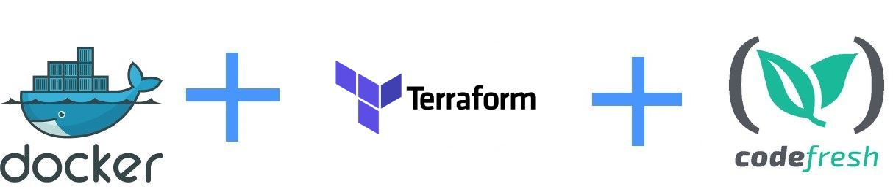

# Using Terraform inside Docker with Codefresh

This is an example Terraform deployment that runs in a Codefresh pipeline using docker.
More details can be found in [the documentation page](https://codefresh.io/docs/docs/yaml-examples/examples/terraform).

## Prerequisites

1. Create a [free Codefresh account](https://codefresh.io/docs/docs/getting-started/create-a-codefresh-account/)
1. Create a [Google cloud account](https://cloud.google.com/)
1. Create a [Google Service account key](https://cloud.google.com/iam/docs/creating-managing-service-account-keys)

## Create Codefresh pipeline

To use Terraform with Codefresh

1. Create a new pipeline
1. Add you service account json as a variable called `ACCOUNT_JSON_CONTENT`
1. Add the [pipeline content](codefresh.yml)

That's it! Run the pipeline to see it in action.

Enjoy!

